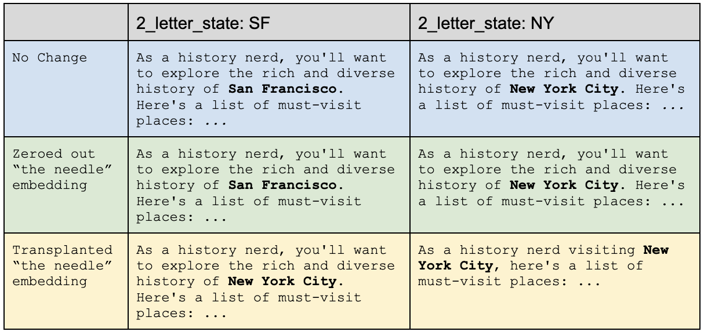
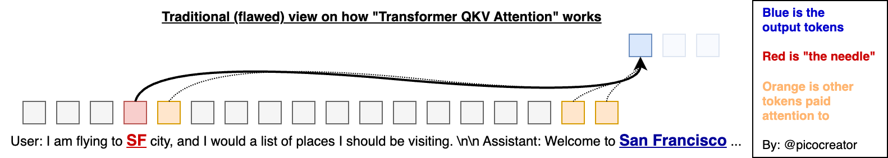
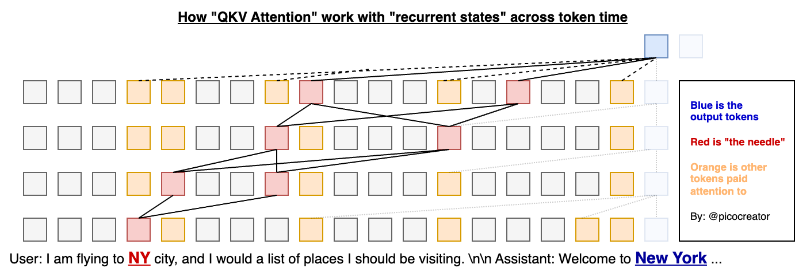
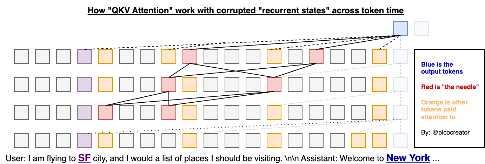
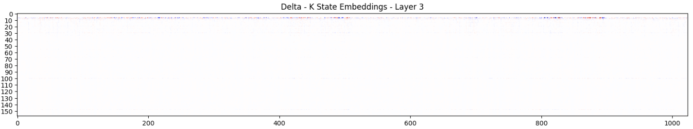
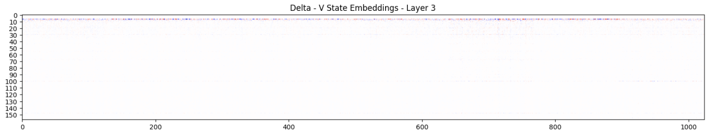
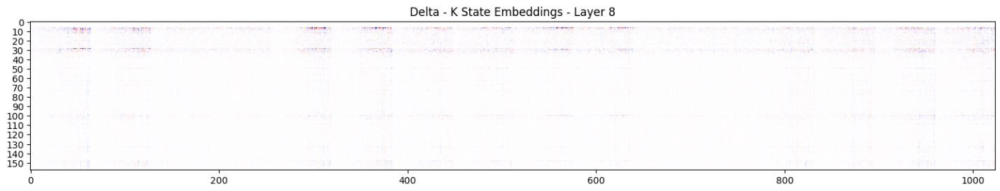
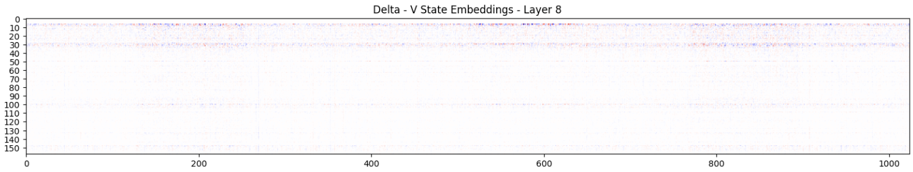
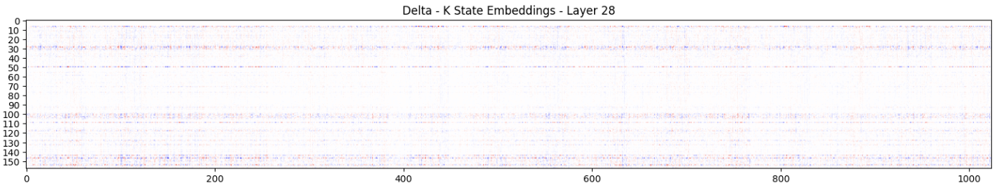
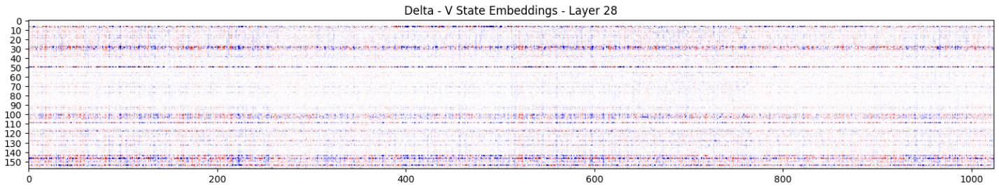

# QKV Transformers are RNN models with extra steps and memory capacity

**Author: Eugene Cheah ( @picocreator )**

## Abstract

The information stored into a transformer model KV cache, represents not just the existing token information. But the model embedding state generated recurrently from the previous tokens, mixed in. 

We Prove this by prompting the model with a critical piece of information "the needle", in a multi-step/chain-of-thought format, while avoiding repeating the critical information. 

We subsequently modify the KV cache, to remove "the needle" and prove that the subsequent embedding stored in other tokens has sufficient information kept recurrently, to answer the question.

## Implementation

All notebook files, can be found in this repo. The following is the key highlights (simplified).
With examples taken from the [./llama3-8b-short-prompt.ipynb](./llama3-8b-short-prompt.ipynb) file.

We start by importing and loading the respective model (llama 3.1-8B instruct in this case)

```python
from transformers import LlamaForCausalLM, AutoTokenizer
model_id = "meta-llama/Meta-Llama-3.1-8B-Instruct"

# Load the model and tokenizer
model = LlamaForCausalLM.from_pretrained(model_id)
tokenizer = AutoTokenizer.from_pretrained(model_id)
```

We prepare the prompt in approximately the following format, which was generated and modified by chat.

```
User: I am flying to <2_letter_state> city and I would want you to think about a list of places I should be traveling and visiting, as a history nerd. Let me know when your ready (do not answer now, do not ask additional questions). I will ask you again later for the full answer. 


Assistant: Hmm... Ok, (pause), I'm ready to answer now.


User: Great, now tell me the full answer.


Assistant: <generated answer here>
```

With the <2_letter_state> being replaced by “SF” and “NY” respectively.
The following is the next 100 token output, for greedy sampling (after Assistant: )


We use the following to generate the kv_cache, and forward using the kv_cache

```python
def forward_and_get_output(input_ids, past_key_values=None):
   return model(input_ids, use_cache=True, past_key_values=past_key_values)


def forward_and_get_kv_cache(input_ids, past_key_values=None):
   return forward_and_get_output(input_ids, past_key_values).past_key_values


def generate_with_kv_cache(input_ids, past_key_values, max_new_tokens=100):
   outputs = forward_and_get_output(input_ids, past_key_values)

   # Output tokens
   generated_tokens = []

   # Generate 1 token at a time
   for i in range(max_new_tokens):
       # Greedy Sample the top 1 token (lazy)
       next_token = torch.argmax(outputs.logits[:, -1, :])
       # Append the token to the generated tokens
       generated_tokens.append(next_token)

       # Forward the model
       outputs = forward_and_get_output(next_token.unsqueeze(0).unsqueeze(0), outputs.past_key_values)
       # Append the new outputs to the past_key_values
       past_key_values = outputs.past_key_values

   # Generated tokens to tensor
   generated_tokens = torch.stack(generated_tokens, dim=0)

   # Convert the generated tokens -> text
   return tokenizer.decode(generated_tokens, skip_special_tokens=True)
```

This lets us generate the KV cache, which we can subsequently modify, and use it as part of the forward pass. The modification can be done with something like the following …

```python
needle_pos = 7

for layer_idx in range(len(kv_cache_x)):
   for kv_idx in range(2):
       # Transplant the prefix tokens from A to X
       kv_cache_x[layer_idx][kv_idx][:, :,needle_pos:needle_pos+1] = kv_cache_a[layer_idx][kv_idx][:, :, needle_pos:needle_pos+1]

       # Alternatively just zero out the needle token
       kv_cache_x[layer_idx][kv_idx][:, :, needle_pos:needle_pos+1] = 0
```

We then either substitute the target token embedding, or zero it out respectively.

Resulting into the following effect (list was shorten for simplicity, refer to notebook for larger outputs)



### Model works with zero-ed out needle token state

In both cases, the model was able to answer, despite having the "needle token" essentially removed.
Providing sold proof that it's embedding information, is stored recurrently into future tokens, which are subsequently used to answer the question.

### Model is semi-resistent to needle token being replaced

In the scenerio where we replaced the needle token, with another city state. Both of the following scenerio occurs.

Needle token embedding
- **is significant enough:** that the attention mechanic pays attention to it, in favour over the recurrent embedding values
- **is not-significant enough:** that the recurrent embedding values, are paid attention to instead (this is more significant, in implications)

Depending on the prompt, chain of thought, or the token - either outcome are possible

## Immediate Implication

Transformers QKV Attention, is typically framed / understood as, paying attention to the various specific tokens while generating the output token.

| |
|---|
| |
||

However this might be an oversimplification, which only happens on the first few layers.

> **It would be more accurate to view QKV attention, as paying “attention” to “recurrent states” at various points in time. And not just the token itself.**

| |
|---|
|  |
||

It would also help to explain how the model would be resistent to changes when we either zero out, or replace the needle token (the purple embedding blocks below)

| |
|---|
|  |
||

In overall, it will also help explain, how thinking tokens, and chain of thought works, where it allows the model to develop and store its understanding into the newer tokens respectively. As part of the process in building an answer. In addition to accuracy via reptition of key words.

## Larger Implications

One of the advantages transformer QKV attention has over older RNN recurrent LSTM designs, is how it has, substantially larger VRAM size which grows over the number of tokens (also LSTM does not scale in training). Giving the model the ability to retain access to older recurrent state (which will not get zero-ed out)

But, if QKV are just recurrent states. What is its big difference when compared to the progress of newer Recurrent LLM, like RWKV, StateSpace, XLSTM, being developed With substantially larger state size compared to LSTM. 

It does raises the question?; How much of the transformer performance advantages from these new recurrent model is simply from having access to a much larger state (eg. multi gigabyte transformer states for a few thousand tokens).

| Architecture | VRAM State Size | Effective Context Length |
|---|---|---|
| RWKV 7B v4 Raven | 4 MB | 2k |
| RWKV 7B v5 Eagle | 40 MB | 4k |
| RWKV 14B v6 Finch | 80 MB | 16k |
| LLaMA 7B (2k) | 400 MB | 2K |
| LLaMA 7B (4k) | 780 MB | 4k |
| LLaMA 7B (8k) | 1.53 GB | 8k |
| LLaMA 7B (32k) | 6.04 GB | 32k |
| LLaMA 7B (320k) | 60.18 GB | 320k |
| Theorectical RWKV / SSM scaled up model | 800 MB | 160k |
| Theorectical RWKV / SSM scaled up model | 1.6 GB | 320k |

Will we see a convergence between the two architecture branches?
- As recurrent model state size scales up, increases, and catches up with transformer context sizes
- As transformer models get capped to specific “sliding window attention” sizes for system VRAM capacity constraints. (There is only so much VRAM you can afford per request, large 405B models with large context length is counted in TB's of VRAM)
- Or a trade off between one or another, between scalability and accuracy

What happens when the recurrent model state is larger or equal to the transformer model KV state size, in terms of model performance?

What if the entire attention vs recurrent model debate, is really all about how we manage the state size of the model, and make use of it?

## Lets dive deeper into the embeddings

The following was taken from the larger prompt [./llama3-8b-long-prompt.ipynb](./llama3-8b-long-prompt.ipynb) varient.
Where we do a deep dive into how the embeddings in the KV cache differs across both prompt, with 1 token change.

The delta was built using the following

```python
delta_kv_state = copy.deepcopy(sf_kv_cache)
for layer_idx in range(len(delta_kv_state)):
    for kv_idx in range(2):
        delta_kv_state[layer_idx][kv_idx][:] -= ny_kv_cache[layer_idx][kv_idx][:]
```

which results into the following observations

> Y axis represents the token position (0-160), 
> X axies representing the embedding values in a layer
> Blue is positive value difference, Red is negative, White is no change.
> ( Refer to the notebook for more detail heat maps )

### Minimal change on first ~3 layers




While there will be obvious large changes on "the needle" token representing SF or NY. At position 7 (aka token 8)

For the subsequent tokens, as most of the attention is on the incoming text embeding, minimal deltas are observed (you can see small amounts if you squint)

### Noticable changes on layer 8 (and beyond)




Subsequently, we start to notice changes in the K/V values not just on the needle token. But its subsequent tokens which it influences on.

We start seeing slightly, early bands of lines, which the model seems to reinforces the information into K/V cache store, as hotspots at approximately 30, 50, 100, 150.

This trend would be seen strengthen in subsequent layers

### Dramatic changes around layer 28 (towards the end of the model, especially the V state)




We start to see stronger amplification, and divergence in the value store, in the upper layers. Reinforcing the respective information. 

This is consistent with the hypothesis that the upper layers may be a larger mixture of recurrent information (from the lower layers), mixed in over the embedding token. Creating larger and larger differences.

### Why are the diverging amplification important

If no recurrent information is being stored in the KV cache embedding down the layers. Since the text is exactly the same, we should expect the divergence to be minimal (white).

However, as a divergence, in KV embedding values can be found. Even throughout the later distant token, with the exact same text. We can presume some form of recurrent data is being passed from 1 token embedding to another (possibly in a cascading fashion)

Proving that the KV cache is recurrent in nature. As the next token embedding will be built incorporating the historical embeddings, from various previous tokens.

### Shamless Plug

If all of this makes sense for you. Consider supporting the transformer killer, the [RWKV project](https://wiki.rwkv.com) =)  

Following me at twitter [@PicoCreator](https://x.com/picocreator)

Or using one of our platforms like [featherless.ai](https://featherless.ai), where you can run any huggingface model, and will help support and fund our opensource RWKV model work.
