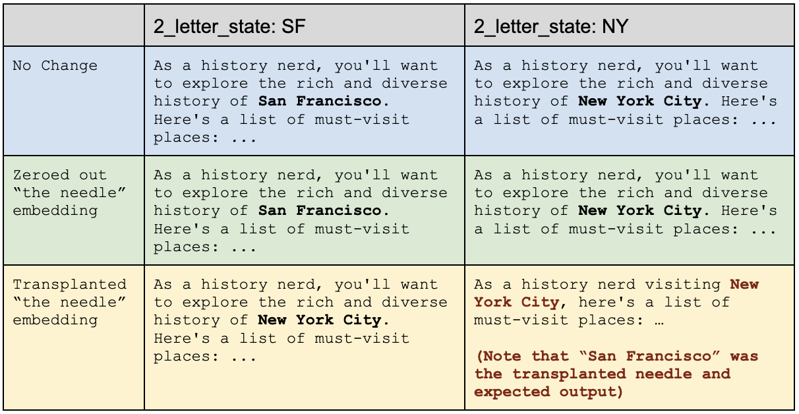

# QKV Transformers are RNN models with extra steps and memory capacity

**Author: Eugene Cheah ( @picocreator )**

## Abstract

The information stored into a transformer model KV cache, represents not just the existing token information. But the model embedding state generated recurrently from the previous tokens, mixed in. 

We Prove this by prompting the model with a critical piece of information "the needle", in a multi-step/chain-of-thought format, while avoiding repeating the critical information. 

We subsequently modify the KV cache, to remove "the needle" and prove that the subsequent embedding stored in other tokens has sufficient information kept recurrently, to answer the question.

## Implementation

All notebook files, can be found in this repo. The following is the key highlights (simplified).
With examples taken from the [./llama3-8b-short-prompt.ipynb](./llama3-8b-long-prompt.ipynb) file.

We start by importing and loading the respective model (llama 3.1-8B instruct in this case)

```python
from transformers import LlamaForCausalLM, AutoTokenizer
model_id = "meta-llama/Meta-Llama-3.1-8B-Instruct"

# Load the model and tokenizer
model = LlamaForCausalLM.from_pretrained(model_id)
tokenizer = AutoTokenizer.from_pretrained(model_id)
```

We prepare the prompt in approximately the following format, which was generated and modified by chat.

```
User: I am flying to <2_letter_state> city and I would want you to think about a list of places I should be traveling and visiting, as a history nerd. Let me know when your ready (do not answer now, do not ask additional questions). I will ask you again later for the full answer. 


Assistant: Hmm... Ok, (pause), I'm ready to answer now.


User: Great, now tell me the full answer.


Assistant: <generated answer here>
```

With the <2_letter_state> being replaced by “SF” and “NY” respectively.
The following is the next 100 token output, for greedy sampling (after Assistant: )


We use the following to generate the kv_cache, and forward using the kv_cache

```python
def forward_and_get_output(input_ids, past_key_values=None):
   return model(input_ids, use_cache=True, past_key_values=past_key_values)


def forward_and_get_kv_cache(input_ids, past_key_values=None):
   return forward_and_get_output(input_ids, past_key_values).past_key_values


def generate_with_kv_cache(input_ids, past_key_values, max_new_tokens=100):
   outputs = forward_and_get_output(input_ids, past_key_values)

   # Output tokens
   generated_tokens = []

   # Generate 1 token at a time
   for i in range(max_new_tokens):
       # Greedy Sample the top 1 token (lazy)
       next_token = torch.argmax(outputs.logits[:, -1, :])
       # Append the token to the generated tokens
       generated_tokens.append(next_token)

       # Forward the model
       outputs = forward_and_get_output(next_token.unsqueeze(0).unsqueeze(0), outputs.past_key_values)
       # Append the new outputs to the past_key_values
       past_key_values = outputs.past_key_values

   # Generated tokens to tensor
   generated_tokens = torch.stack(generated_tokens, dim=0)

   # Convert the generated tokens -> text
   return tokenizer.decode(generated_tokens, skip_special_tokens=True)
```

This lets us generate the KV cache, which we can subsequently modify, and use it as part of the forward pass. The modification can be done with something like the following …

```python
needle_pos = 7

for layer_idx in range(len(kv_cache_x)):
   for kv_idx in range(2):
       # Transplant the prefix tokens from A to X
       kv_cache_x[layer_idx][kv_idx][:, :,needle_pos:needle_pos+1] = kv_cache_a[layer_idx][kv_idx][:, :, needle_pos:needle_pos+1]

       # Alternatively just zero out the needle token
       kv_cache_x[layer_idx][kv_idx][:, :, needle_pos:needle_pos+1] = 0
```

We then either substitute the target token embedding, or zero it out respectively.

> @ TODO : Example digram of how we modify

Resulting into the following effect (list was shorten for simplicity, refer to notebook for larger outputs)



### Model works with zero-ed out needle token state

In both cases, the model was able to answer, despite having the "needle token" essentially removed.
Providing sold proof that it's embedding information, is stored recurrently into future tokens, which are subsequently used to answer the question.

### Model is semi-resistent to needle token being replaced

In the scenerio where we replaced the needle token, with another city state. Both of the following scenerio occurs.

Needle token embedding
- **is significant enough:** that the attention mechanic pays attention to it, in favour over the recurrent embedding values
- **is not-significant enough:** that the recurrent embedding values, are paid attention to instead (this is more significant, in implications)

Depending on the prompt, chain of thought, or the token - either outcome are possible

## Implication

